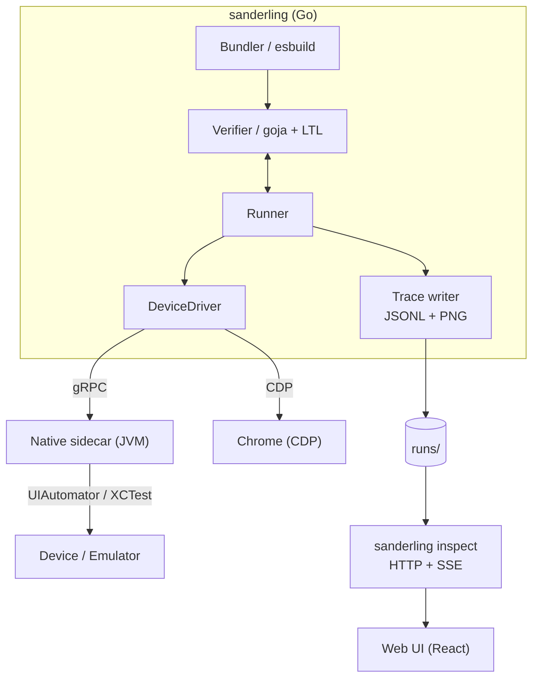

# Architecture



## Processes

**sanderling (Go).** The top-level binary. Bundles the spec with esbuild, evaluates it in goja, runs the main loop, dispatches actions through the `DeviceDriver` interface, writes the trace.

**Native sidecar (JVM).** A Kotlin process that exposes a gRPC surface matching the `DeviceDriver` interface. Handles UI input, screenshots, the system accessibility tree, and OS-level alerts. Native platforms only.

**Chrome (CDP).** For web targets, the Go binary drives Chrome directly over the Chrome DevTools Protocol. No sidecar is involved.

## Transports

| Channel | Platform | Transport | Purpose |
|---|---|---|---|
| Go to native sidecar | Native | gRPC (localhost TCP) | UI input, screenshots, system alerts |
| Go to Chrome | Web | Chrome DevTools Protocol | UI input, screenshots, DOM hierarchy, console logs |

On native, the transport split exists because only real UI events need to cross process and OS-API boundaries. Introspection is cheap, frequent, and lives on a fast local socket directly to the app. On web, CDP handles both.

## Inspect UI

`sanderling inspect` is a separate mode of the same Go binary. It serves an embedded React bundle and reads `runs/` from disk, streaming file-watcher events over SSE so the UI updates as new steps land. It has no connection to any driver; it only consumes the trace artifacts.

## Per-step cycle

The heart of the system is:

```
fetch state  ─►  evaluate properties  ─►  pick action  ─►  dispatch
```

**Native (Android / iOS):**

1. The runner asks the driver to wait until the UI is idle.
2. The runner fetches the UI hierarchy and logs from the sidecar.
3. The runner feeds state into goja. Extractors re-read; properties re-evaluate; the action generator returns a weighted tree.
4. The runner writes the trace entry for this step.
5. The runner picks an action by weight and dispatches it through the driver (gRPC to sidecar -> UIAutomator or XCTest).
6. Loop.

**Web (Chrome):**

CDP captures the DOM hierarchy and console logs directly. The rest of the cycle is identical.

The cycle runs hundreds of times per minute. Every step produces one row in `trace.jsonl` and one screenshot.

